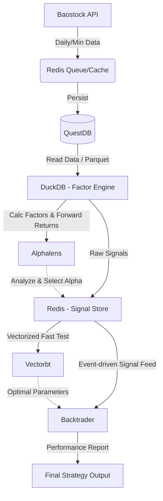

# Objective
设计并规划一个基于 `Backtrader / Vectorbt + Alphalens + DuckDB + QuestDB + Redis + Baostock` 的量化交易分析工作流。该架构初期将以日线数据为基础，打通因子挖掘、回测和评估的全流程，并具备向日内高频（分钟/Tick）扩展的极强伸缩性。

# 环境说明
- **Python 环境**: 位于 `quant_stock_env/` 的 `uv` 虚拟环境。
- **运行模式**: 原生安装运行（不使用 Docker），需手动配置 Redis 和 QuestDB 服务。

# Key Components & Architecture Roles

1. **Baostock (数据源)**: 
   - 负责获取A股历史日K线数据、财务数据以及未来的分钟级高频数据。免费且无需注册，适合初期搭建。

2. **Redis (多功能内存层 - 核心纽带)**:
   - **角色1 (缓存与缓冲)**: 缓存Baostock的静态元数据（如股票列表、行业分类），减轻重复请求；在未来接入高频数据时，作为Tick数据的实时内存缓冲区。
   - **角色2 (信号总线 & 状态管理)**: 因子计算完毕后，将生成的交易信号（Signals）、最新持仓状态快速写入Redis。回测引擎和未来的模拟交易模块可以直接从Redis订阅（Pub/Sub）或读取最新信号，实现“计算”与“执行”的解耦。
   - **角色3 (任务队列Broker)**: 配合Celery等分布式任务框架，管理百万级股票代码的数据抓取或因子计算任务。

3. **QuestDB (高性能时序数据库)**:
   - 负责持久化存储所有的行情数据（OHLCV）。
   - 其底层基于列式存储，对时间序列数据的 Append（追加）和基于时间窗口的聚合查询（如重采样）进行了极限优化。未来处理海量高频数据时毫无压力。

4. **DuckDB (进程内OLAP分析引擎)**:
   - 负责海量面板数据（Panel Data）的截面分析和因子计算。
   - DuckDB 可以直接读取 QuestDB 导出的 Parquet 文件，或者通过 Postgres 协议直连 QuestDB。利用 DuckDB 极速的 SQL 窗口函数处理能力，可以飞速计算全市场的移动平均、动量、波动率等各种 Alpha 因子。

5. **Alphalens (因子有效性分析)**:
   - 接收 DuckDB 计算出的因子值（Factor）和未来的收益率（Forward Returns）。
   - 生成详细的因子 Tear Sheet（IC/IR分析、分层收益率分布、换手率分析），筛选出真正具有预测能力的 Alpha 因子。

6. **Vectorbt + Backtrader (双层回测引擎)**:
   - **第一层 (初筛): Vectorbt**。作为向量化回测框架，速度极快。将经过 Alphalens 验证的因子信号转化为 DataFrame 批量喂给 Vectorbt，用于大规模多标的、多参数的网格寻优（Grid Search）。
   - **第二层 (精细模拟): Backtrader**。基于事件驱动。将 Vectorbt 筛选出的最优参数组合放入 Backtrader 中。在这里加入真实的交易约束条件：如A股的 T+1 限制、滑点（Slippage）、印花税、手续费、以及复杂的订单逻辑（止盈止损单）。

# Architecture Data Flow

# Implementation Steps

1. **Phase 1: 基础设施与数据管道建设 (Infrastructure & Data Ingestion)**
   - 确保本地 Redis 和 QuestDB 服务已安装并启动。
   - 使用 `uv` 安装必要包：`baostock`, `redis`, `psycopg2-binary` (QuestDB接口), `duckdb`, `pandas`。
   - 编写 Python 脚本，通过 Baostock 拉取全市场A股日线数据。
   - 实现数据写入逻辑：最新快照进 Redis，历史完整时序通过 InfluxDB Line Protocol 进 QuestDB。

2. **Phase 2: 因子计算层搭建 (Factor Computation)**
   - 建立 DuckDB 与 QuestDB 的数据读取链路（推荐通过 Parquet 或 PostgreSQL 协议）。
   - 编写 DuckDB SQL (或搭配 Ibis) 生成基础因子体系（如 MACD, RSI, 截面动量）。

3. **Phase 3: 因子评估与信号生成 (Alpha Evaluation)**
   - 使用 Pandas 处理 DuckDB 吐出的因子表，格式化为 Alphalens 所需格式。
   - 运行 Alphalens 进行测试，筛选有效因子并转化为信号存入 Redis。

4. **Phase 4: 双核回测流水线 (Backtesting Pipeline)**
   - **Vectorbt**: 快速扫描参数空间。
   - **Backtrader**: 结合 A 股交易规则进行精细化模拟。

5. **Phase 5: 进阶拓展 - 高频与实盘模拟 (Future Scope)**
   - 接入分钟级数据，利用 Redis Pub/Sub 实现准实时信号触发。

# Verification & Testing
- **Data Integrity Test**: 比对 QuestDB 与 Baostock 原始数据。
- **Factor Correctness Test**: 编写单元测试验证因子逻辑。
- **Backtest Reconciliation**: 核对 Vectorbt 与 Backtrader 的逻辑一致性。
